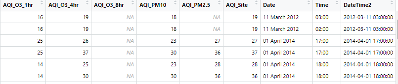
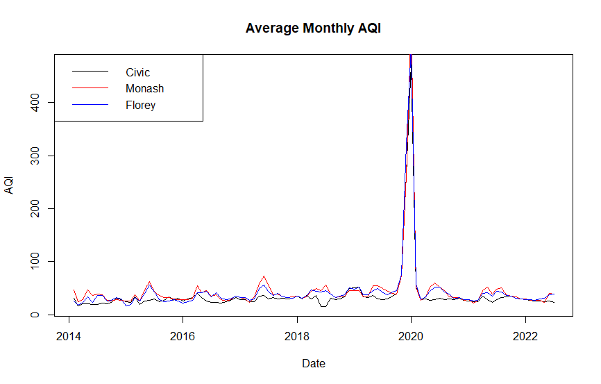
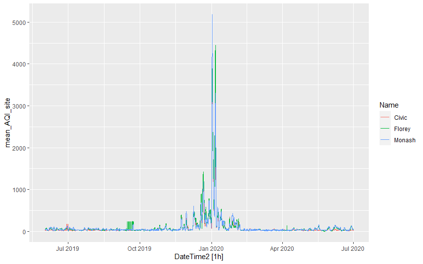

# TNMD Hackathon Theme 2 - Open Data - ACT Air quality monitoring data

## Introduction

The ACT government is required to report on air quality to monitor compliance with NEPC standards (National Environmental Protection Council). In addition to providing live information from air quality monitoring stations and publishing the data in annual reports, archival data is available through the Australian Govenrment's open data portal: [data.gov.au](https://data.gov.au/dataset/ds-act-https%3A%2F%2Fwww.data.act.gov.au%2Fapi%2Fviews%2F94a5-zqnn/details?q)

This dataset has the potential to allow users to look more closely into specific events than would be possible using the year-long time series that are published. However the data is described as unverified - meaning that it has undergone minimal or no quality assurance checks. Additionally, there is no summary of what is contained in the dataset.

## Aim

This document will complement the ACT air quality dataset by providing a summary of the contents and range of the data and basic information about the data quality. It also contains some example visualisations focussing on adverse Air Quality events triggered by bushfires to show the potential value of the open access dataset

## Dataset summary

Air quality is recorded at 3 sites across the ACT at the top of each hour, the data availability varies by site and for some data items are missing for long periods of time. 

| Site name | Coordinates | Data Availability|
|---|---|---|
|Civic (Central Canberra)|(-35.285399, 149.131536)|Since Jan 2012|
|Florey (North Canberra)|(-35.220606, 149.0435)|Since Feb 2014|
|Monash (South Canberra)|(-35.418302, 149.094018)|Since Jan 2012|

At time of writing the most recent data was for 2022-07-28 13:00:00 AEST

## Data items

|Data item name|Description/unit|
|---|---|
|Name|Location of sensor|
|GPS|Latitude and longitude|
|DateTime|dd/mm/yyyy hh:mm|
|NO2|NO2 concentration averaged over 1 hour in ppm|
|O3_1hr|O3 concentration averaged over 1 hours in ppm|
|O3_4hr|O3 concentration averaged over 4 hours in ppm|
|O3_8hr|O3 concentration averaged over 8 hours in ppm|
|CO|NO2 concentration averaged over 8 hours in ppm|
|PM10.1.hr|P10 particulates averaged over 1 hour in ug/m^3|
|PM2.5.1.h|P2.5 particulates averaged over 1 hour in ug/m^3|
|PM10|P10 particulates averaged over 24 hours in ug/m^3|
|PM2.5|P2.5 particulates averaged over 24 hours in ug/m^3|
|AQI_CO|CO component of Air Quality Index|
|AQI_NO2|NO2 component of Air Quality Index|
|AQI_O3_1hr|1 hour O3 component of Air Quality Index|
|AQI_O3_4hr|4 hour O3 component of Air Quality Index|
|AQI_O3_8hr|8 hour O3 component of Air Quality Index|
|AQI_PM10| P10 component of Air Quality Index|
|AQI_PM2.5|P2.5 component of Air Quality Index|
|AQI_Site|Overall Air quality index for the measurement site|
|Date|Date in  dd/ month/ YYYY|
|Time|Time mostly HH:MM|

### Data Cleaning steps

Removed duplicate date times, and added missing date times to complete time series

## Data quality

Some issues observed with the original dataset were:

-   The reference period of the data was not provided upfront.
-   The dataset was not sorted in any particular order. Given the time series nature of the data it would be useful to sort it by location and time.
-   There are missing observations, most notably the latter part of 2012 and all of 2013.
-   Duplicate records for the same location and time with different observation measurements. Some records are duplicated upto 20 times in the date. It would be useful to have information on why duplicates occur to inform which observations should be used. The below image shows examples of duplicated records.

The percentage of missing records are summarised below for each site.

|            | Civic      | Florey     | Monash     |
|------------|------------|------------|------------|
| NO2        | 85.681853  | 6.991857   | 4.952469   |
| CO         | 80.891973  | 12.334652  | 5.173893   |
| O3_1hr     | 5.206493   | 5.209565   | 5.066079   |
| O3_4hr     | 2.402546   | 12.118493  | 1.505912   |
| O3_8hr     | 89.04167   | 87.22215   | 89.37978   |
| PM10.1.hr  | 84.58415   | 80.47229   | 84.35660   |
| PM2.5.1.hr | 84.90831   | 80.53618   | 84.49571   |
| PM10       | 5.825561   | 3.580896   | 2.329005   |
| PM2.5      | 32.807106  | 5.140231   | 12.872710  |
| AQI_CO     | 76.351359  | 12.329214  | 5.397635   |
| AQI_NO2    | 76.360721  | 6.991857   | 5.372131   |
| AQI_03_1hr | 5.305965   | 5.212284   | 5.519360   |
| AQI_03_4hr | 2.435314   | 12.118493  | 1.757477   |
| AQI_03_8hr | 89.07327   | 87.25750   | 89.41108   |
| AQI_PM10   | 5.850136   | 3.582256   | 2.334802   |
| AQI_PM2.5  | 28.074569  | 5.107604   | 12.872710  |
| AQI_Site   | 0.02925653 | 0.64167924 | 0.51472293 |

## Case study visualisations

Time series showing the monthly averages of the AQI_site data starting form 2014 to the latest date available. Note the large spike around Christmas 2019 corresponding to the bushfires that affected south east Australia during this time.

Graph showing the Air Quality Index in December 2019.

## Key links

[Air Quality Monitoring Data \@ data.gov.au](https://data.gov.au/dataset/ds-act-https%3A%2F%2Fwww.data.act.gov.au%2Fapi%2Fviews%2F94a5-zqnn/details?q)

[Information on ACT Air quality monitoring including "live" monitoring](https://www.health.act.gov.au/about-our-health-system/population-health/environmental-monitoring/monitoring-and-regulating-air)

[ACT Air Quality reports](https://www.accesscanberra.act.gov.au/s/article/air-pollution-tab-related-resources)

[Description of the Air Quality Index calculation (AQI)](https://www.health.act.gov.au/about-our-health-system/population-health/environmental-monitoring/air-quality/measuring-air)
